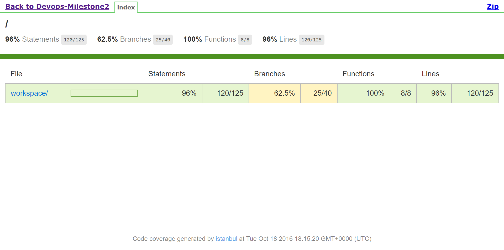

# MILESTONE: TEST+ANALYSIS

The goal of this milestone is to implement a testing component and an analysis component for building a target project.
For this milestone, we have used the project [Climbing Grade](https://github.com/Grantismo/climbing-grade.js/), which is used to convert different climbing grades between different systems. We've used Jenkins for managing out CI pipeline, which is hosted on a DigitalOcean droplet. 

### Test Section

For the test section, the pipeline first runs the unit test for the project, which were already part of the test suite. This runs the test and fails the build if any test fails.

We've used istanbul to measure coverage and report the results. The basic unit tests return a low coverage for the project. As a result these statistics were removed from the build pipeline. 

Hence, we've made use of the test case generation technique, and used [main.js](https://github.ncsu.edu/sarora6/DevOps-Milestone2/blob/master/main.js) to generate a new [test.js](https://github.ncsu.edu/sarora6/DevOps-Milestone2/blob/master/test.js) file based on the systems provided in the base file. The coverage results now show up better statistics. 

The coverage report would also be generated after the build.

### Analysis Section

For the code analysis, we've used ESLint for static analysis and extended by creating custom rules for custom metrics. The rules are configured in the [.eslintrc.json](https://github.ncsu.edu/sarora6/DevOps-Milestone2/blob/master/.eslintrc.json) file. This also included the two custom rules created and saved in [eslint_rules](https://github.ncsu.edu/sarora6/DevOps-Milestone2/tree/master/eslint_rules) directory. The output of the console output contains the code analysis results.

The figure shows static analysis results, like missing semicolon and use of single quotes. It also shows the custom rules results, i.e. too many if conditions, function too long, and comment-code line ratio (Free-Style). 

### Commit Acceptance

We've used the Jenkins Log Parser plugin as a post-build task to parse the console output based to regex patterns defined in [rule](https://github.ncsu.edu/sarora6/DevOps-Milestone2/blob/master/parsing_rules/rule) file. This would mark the build is failed if any of the rules are matched. We've used the following conditions:

1. If any of the unit test fails.
2. If the Statement coverage falls below 90%.
2. If the max-if-conditions in an if statement exceeds the value specified in the config file.
3. If the function size is longer than the statement limit specified in the config file.
4. If any of the other build step fails.

If the log parser passes with 0 errors, the commit is accepted else the commit it reverted back.

[Link to Screencast Video](https://youtu.be/IwbhFb2Uyt4)
